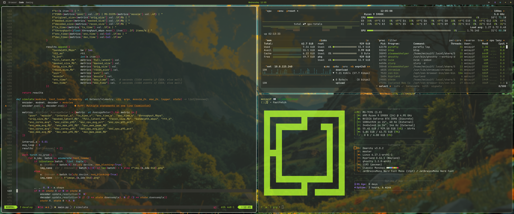

# 🌙 Monokai Classic — Omarchy Theme

A unified **Monokai Classic** theme for Omarchy + Hyprland.  
Warm tones, high contrast, and classic Monokai vibes across all components — Waybar, Mako, Ghostty, Alacritty, btop, Hyperlock, and SwayOSD.

<p align="center">
  
</p>

---

## 🎨 Palette
bg: #272822 | fg: #f8f8f2 | green: #a6e22e | yellow: #e6db74
orange: #fd971f | red: #f92672 | blue: #66d9ef | purple: #ae81ff

---

## ⚙️ Installation
```bash
omarchy-theme-install https://github.com/mnisyif/omarchy-classic-monokai
```
---

## 🧩 Credits

Monokai Classic Palette: khoido2003/classic_monokai.nvim
Original Monokai: Wimer Hazenberg
Icons: Papirus-Dark
Base system: Omarchy

---

Author: Murtadha Nisyif
License: MIT
Version: 1.0 — 2025-10-08
